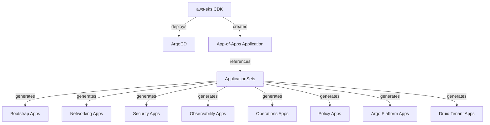
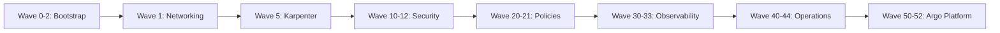

# Architecture Overview

## GitOps Model

This repository implements the **App-of-Apps** pattern for ArgoCD. It is the EKS variant of a multi-cloud GitOps strategy (`eks-gitops`, `gke-gitops`, `aks-gitops`). The CDK infrastructure ([aws-eks](https://github.com/stxkxs/aws-eks)) deploys ArgoCD and creates a root Application that points to this repository's `applicationsets/` directory.



## ApplicationSet Pattern

All 10 ApplicationSets use the **matrix generator** combining:

1. **Clusters generator** — selects clusters by label `argocd.argoproj.io/secret-type: cluster`
2. **List generator** — defines addons with name, namespace, path, and sync wave

There are two template styles depending on the addon type:

**Helm addons** use ArgoCD multi-source. The chart is fetched from the Helm repo, and values are resolved from this Git repository via a `$values` ref:
```yaml
sources:
  - repoURL: '{{ .chartRepo }}'
    chart: '{{ .chart }}'
    targetRevision: '{{ .chartVersion }}'
    helm:
      valueFiles:
        - $values/{{ .path }}/values.yaml
        - $values/{{ .path }}/values-{{ index .metadata.labels "environment" }}.yaml
  - repoURL: https://github.com/stxkxs/eks-gitops.git
    targetRevision: main
    ref: values
```

**Kustomize addons** use single-source with environment-specific overlay paths:
```yaml
source:
  repoURL: https://github.com/stxkxs/eks-gitops.git
  targetRevision: main
  path: '{{ .path }}/overlays/{{ index .metadata.labels "environment" }}'
```

This enables a single ApplicationSet definition to deploy across dev, staging, and production clusters.

## Sync Wave Ordering

Sync waves ensure addons deploy in the correct dependency order:



| Wave | Category | Components |
|------|----------|------------|
| 0 | Bootstrap | cert-manager, external-secrets, prometheus-operator-crds |
| 1 | Networking | Cilium, ALB Controller, External DNS |
| 2 | Bootstrap | metrics-server, reloader, storage-classes, priority-classes |
| 5 | Karpenter | Karpenter (nodes ready before workloads) |
| 10-12 | Security | Kyverno, Trivy Operator, Falco |
| 20-21 | Policies | Kyverno PSS, Best Practices |
| 30-33 | Observability | Loki, Tempo, Grafana Agent, OpenCost |
| 40-44 | Operations | Velero, VPA, Goldilocks, Descheduler, Karpenter Resources, KEDA |
| 50-52 | Argo Platform | Argo Rollouts, Argo Events, Argo Workflows |

## Helm Values Pattern

The majority of addons use Helm charts managed via ArgoCD multi-source:

```
addons/<category>/<addon>/
  values.yaml              → complete base configuration (shared across all environments)
  values-dev.yaml          → dev-specific overrides ONLY (delta from base)
  values-staging.yaml      → staging-specific overrides ONLY
  values-production.yaml   → production-specific overrides ONLY
```

ArgoCD merges the environment-specific values on top of the base values. This eliminates duplication and makes environment differences explicit.

## Kustomize Addons

Some addons use pure Kustomize without Helm:

- **storage-classes** — EBS gp3 StorageClass and gp2 default removal
- **priority-classes** — PriorityClass resources for platform and tenant workload tiers
- **karpenter-resources** — EC2NodeClass and NodePool CRDs with environment-specific patches
- **Kyverno policies** — ClusterPolicy resources with JSON patch overlays to control enforcement mode

These use the `base/overlays` pattern:

```
addons/<category>/<addon>/
  base/
    kustomization.yaml     → defines resources
    <resource>.yaml        → Kubernetes manifests
  overlays/{dev,staging,production}/
    kustomization.yaml     → references ../../base, may add patches
```
